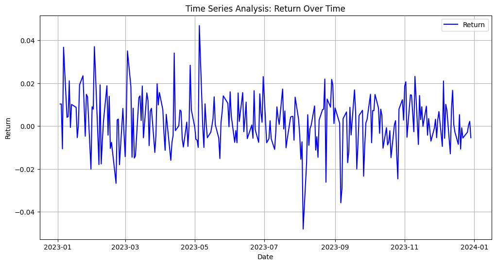

# Sigma-Internship-Coding-Challenge

# Goal

- This exercise will help familiarize me with the Quantrocket platform and also test your coding &
algorithms knowledge while giving you a flavor of how to set up a minimalist trading workflow.

# INITIAL SETUP 

- Installed -- Docker and -- Quantrocket on my local with help of quick tutorials.

# DATA FETCHING 

- Ensured that I am able to pull price data (daily close prices only) for Apple stock (sid=‘AAPL’) for the year 2023 (01-01-2023 to 12-31-2023). This should be available as part of their freely available
us-stock price data.

# MAIN LOGIC

## OBJECTIVE

-Build a simple model to make decisions on certain days using the logic.

## LOGIC

# 1 ADDED COLUMN RETURN 
using 
r(d) = (p(d) - p(d-1))/p(d-1)

# 2 ADDED COLUMN STATE 
using
if r(d) >= 0.1, s(d) = +1
else if r(d) > -0.1, s(d) = 0
else s(d)=-1

# 3 ADDED COLUMN STATUS
using
state as Bull --> (+1)
state as Flat --> (0)
state as Bear --> (-1)

# 4 PLACE BUY ORDER FOR THE DAY d+1

if s(d+1) = 1 & s(d) = 0, then V(d+1) = V(d) + 1
else if s(d+1) = -1 & s(d) = 0, then V(d+1) = V(d) -1
and V(d+1) = V(d) in all other cases

# 5 CALCULATED TRANSITION PROBABILITY MATRIX

## Transition Probability Matrix:

[[0.14285714 0.74285714 0.11428571]
 [0.14649682 0.59872611 0.25477707]
 [0.12280702 0.66666667 0.21052632]]

 # 6 PORTFOLIO VALUE

 - Maximum Portfolio Value : 40
 - Indexes where portfolio value increases by 1: [6, 8, 12, 16, 21, 28, 30, 41, 50, 52, 59, 61, 69, 79, 85, 88, 94, 100, 103, 108, 110, 113, 117, 120, 123, 133, 142, 160, 164, 177, 187, 191, 207, 209, 212, 216, 218, 232, 234, 238]

# 6 TIME SERIES ANALYSIS RETURN OVER TIME

